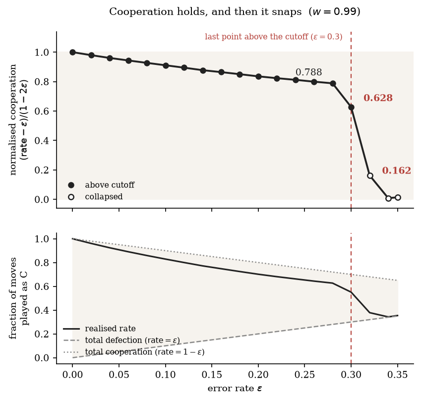

# holds-then-snaps

**When cooperation survives noise, and how it fails.**

An agent-based study of the Iterated Prisoner's Dilemma, asking under what
conditions cooperation survives — and finding that it does not erode. It holds,
and then it snaps.



## The finding

Agents were made unreliable: with probability ε, a player's intended move comes
out wrong. Cooperation was then measured from the moves actually played, not
from which strategies survived.

| Error rate ε | Cooperation, normalised |
|---|---|
| 0.10 | 0.911 |
| 0.20 | 0.836 |
| **0.28** | **0.788** |
| 0.30 | 0.628 |
| **0.32** | **0.162** |
| 0.34 | 0.008 |

At an error rate of 28% — more than a quarter of all moves being mistakes —
cooperation still holds nearly four fifths of what the noise leaves available.
Two grid steps later it is gone. There is no gradual decline to warn you.

The measure is normalised as `(rate − ε) / (1 − 2ε)`, because the observable
rate is trapped in `[ε, 1−ε]` and that band narrows as ε grows. 1 is total
cooperation, 0 is total defection, at every error rate.

**What carries cooperation that far is not stronger retaliation but weaker
reaction.** Of three ways of surviving a mistake, the strongest is dilution —
judging an opponent by their whole record rather than their last move, so a
single slip barely moves the verdict. Removing the one strategy that does this
costs more of the viable region than removing anything else in the pool.

## Two predictions, made before the sweep

Both were derived from the payoff structure while the experiment was still being
built, and both hold:

- **The basin of defection scales as (1 − w)**, where w is the probability the
  game continues for another round. Measured log–log slope 1.046 against a
  derived 1.000.
- **The retaliator share needed rises with ε** — from 0.57% to 10.0% over
  ε = 0 to 0.08, and past ε = 0.10 no share suffices at all.

## The roster is a variable, not a setting

Removing a single strategy changed the tournament winner. So the cast was swept
rather than chosen: across 120 randomly drawn sub-rosters, how much the answer
depends on who entered falls from **0.177** at five strategies to **0.037** at
thirteen. The seven-strategy roster the early phases used turns out to sit at
the *minimum* of 24 draws at its own size — it was close to the worst roster
available, because it had been assembled for a world without mistakes.

## Four times, the indicator failed first

Each of these was believed, written down, and later overturned:

1. A tournament winner that was a property of the roster, not the strategy.
2. Final population shares that recorded a transient, not a result.
3. A metric that scored cooperation by strategy *names*, reporting total victory
   in a population where 22% of moves were cooperative.
4. A grid whose last column was mistaken for a ceiling — which produced a
   conclusion that was **wrong, not imprecise**.

The fourth happened after the first three had already been documented in this
repository's own decision log. That is the part most likely to transfer: a
summary that has reached the edge of what it can express is indistinguishable,
from the inside, from one that has not.

## Running it

```bash
pip install -r requirements.txt
python tournament.py          # Phase A — the round robin
python evolution.py           # Phase B — replicator dynamics
python experiments.py         # Phase C — the (ε, w) sweep
python -m pytest              # 200 tests
```

To watch a single match play out round by round:

```bash
python watch.py "Grim Trigger" "Random" --compare "Tit-for-Tat"
```

To rebuild the report and every figure from the committed data:

```bash
python build_report.py        # data → figures → PDF
python build_report.py --pdf  # typeset only
```

Optional: `requirements-dev.txt` adds the reference implementation used for the
move-for-move cross-check.

## What's here

| Path | |
|---|---|
| `report/report.pdf` | the full report — method, results, corrections, discussion |
| `decisions.md` | every methodological choice, why, and what was rejected |
| `figures/MANIFEST.md` | which figure's numbers come from which file |
| `results/` | the experimental record, committed rather than regenerated |
| `docs/brief.md` | the project brief, including what was deliberately left open |
| `PROJECT_STATE.md` | current state of every settled decision |

Every number in the report traces to a named file under `results/`. Randomness
comes from one documented root seed, with per-match generators keyed by
tournament coordinates, so any single cell reproduces in isolation.

## Reading the model honestly

The population is well-mixed — no neighbourhoods, no network. Nothing learns.
Only execution error is modelled, never misperception, so the two players always
agree about what was played. These are stated in full in the report's
limitations section, along with what remains unverified.
